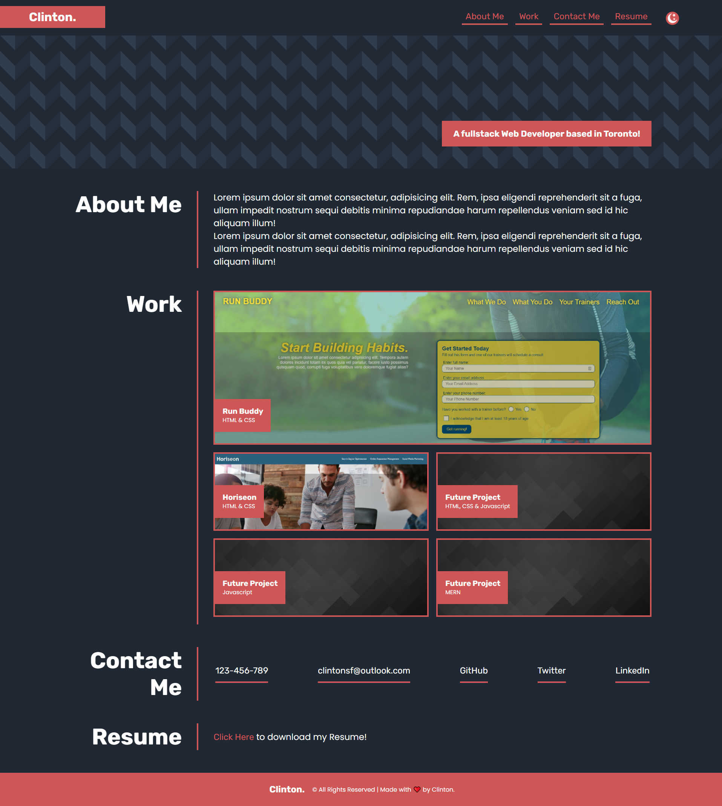

# My Portfolio
This is a portfolio challenge assignment.

## User Story
Employer wants to view the deployed portfolio of work samples So that the employer can review and ass whther the candidate is good for an open position. 

## Languages
HTML & CSS

## Acceptance Criteria
- The portfolio containes the developer's name, a recent photo or avatar, and links to section about the developer and how to contact the developer. 
- When the end user clicks the nav links the UI scrolls to the corresponding section. 
- Whne clicking the link to the Work section the UI scrolls to the works section with titled images of the developer's application. 
- When presented with the developer's first application, that applications's image should be larger than the others. 
- When clicking the image of the application the end user taken to that deployed application. 
- When resizing the page or view the site on various screens and devices the end user presenterd with a responsive layout that adapts the viewport. 

## Mockup

## Final Product Link
[**Click Here**](https://pravton.github.io/portfolio-challenge/) to view the project in Github Pages.

## Final Output
>### NOTE
>The application have two themes Dark and Light. The theme can be switched by clicking the icon on the header.

